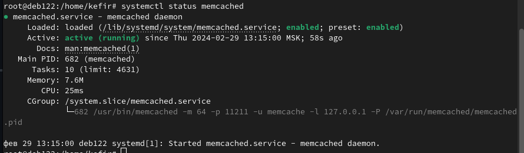
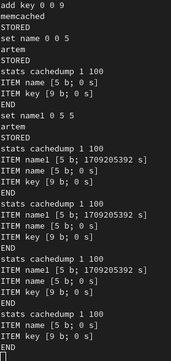
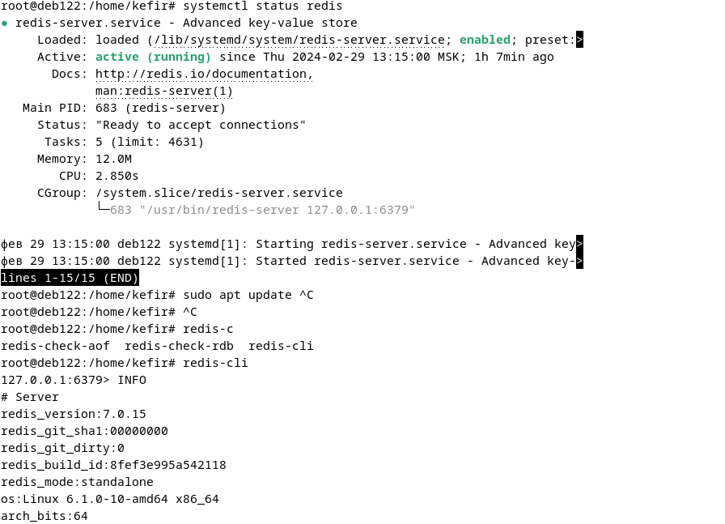
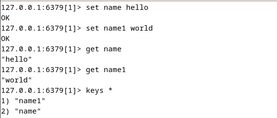
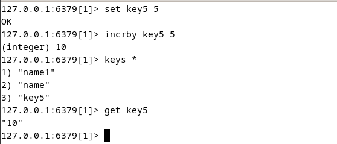

# Домашнее задание к занятию «Кеширование Redis/memcached»
---

### Задание 1. Кеширование 

Приведите примеры проблем, которые может решить кеширование. 

*Приведите ответ в свободной форме.*

 
 Ответ 

1. Пиковые нагрузки на сервер, когда он перестает отвечать из-за большого количества запросов.
2. Позволяет экономить ресурс БД, путем записи часто запрашиваемых/тяжелых запросов в кэш.
3. Снижение времени ответа.

 

---

### Задание 2. Memcached

Установите и запустите memcached.

*Приведите скриншот systemctl status memcached, где будет видно, что memcached запущен.*

 
 Ответ 

- 

 

---

### Задание 3. Удаление по TTL в Memcached

Запишите в memcached несколько ключей с любыми именами и значениями, для которых выставлен TTL 5. 

*Приведите скриншот, на котором видно, что спустя 5 секунд ключи удалились из базы.*

 
 Ответ 

 
add имя_ключа флаги время_хранения размер_данных
данные
- 

 

---

### Задание 4. Запись данных в Redis

Запишите в Redis несколько ключей с любыми именами и значениями. 

*Через redis-cli достаньте все записанные ключи и значения из базы, приведите скриншот этой операции.*

 
  Ответ 

 
- 
- 

 

--- 

### Задание 5*. Работа с числами 

Запишите в Redis ключ key5 со значением типа "int" равным числу 5. Увеличьте его на 5, чтобы в итоге в значении лежало число 10.  

*Приведите скриншот, где будут проделаны все операции и будет видно, что значение key5 стало равно 10.*

 
 Ответ 

 
- 

 

